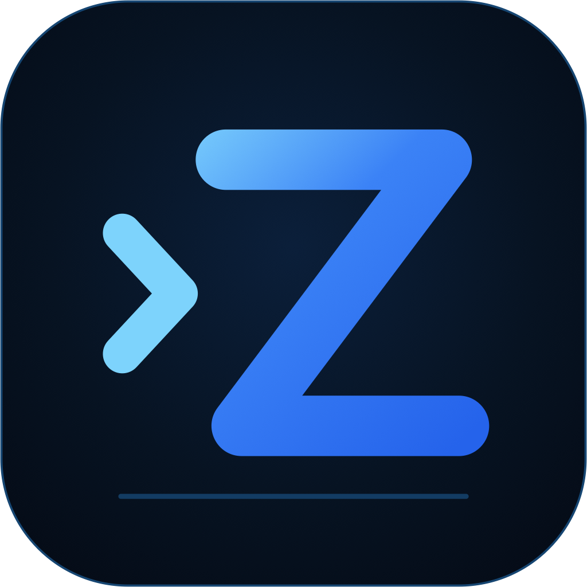

<p align="center">
  
</p>

<p align="center">
  
  
  
</p>

<h1 align="center">Zode</h1>

<p align="center">
  <strong>Terminaliniz için open-source, AI-native kodlama asistanı.</strong><br/>
  Kodunuzu okur, komut çalıştırır, dosya arar ve hızlı bir Rust TUI üzerinden git yönetir.
</p>

<p align="center">
  <a href="../../README.md">English</a> |
  <a href="README.zh.md">简体中文</a> |
  <a href="README.zh-tw.md">繁體中文</a> |
  <a href="README.ja.md">日本語</a> |
  <a href="README.ko.md">한국어</a> |
  <a href="README.es.md">Español</a> |
  <a href="README.fr.md">Français</a> |
  <a href="README.de.md">Deutsch</a> |
  <a href="README.pt.md">Português</a> |
  <a href="README.ru.md">Русский</a> |
  <a href="README.hi.md">हिन्दी</a> |
  <a href="README.id.md">Bahasa Indonesia</a> |
  <a href="README.th.md">ไทย</a> |
  <a href="README.tr.md">Türkçe</a> |
  <a href="README.vi.md">Tiếng Việt</a>
</p>

---

> Bu yerelleştirilmiş README ürün özeti ve hızlı başlangıcı kapsar. Tam benchmark ayrıntıları ve güncel uzun açıklamalar için [İngilizce README](../../README.md) kaynak kabul edilir.

## Öne çıkanlar

- **Multi-provider**: Anthropic, OpenAI, DeepSeek/Moonshot/OpenRouter gibi OpenAI-compatible API'ler ve yerel Ollama.
- **Zengin araç yüzeyi**: file read/write/edit, code ve content search, foreground/background shells, git, web fetch, notebooks ve TODO tracking.
- **Browser control**: `browser_*` araçları managed Chromium'u veya Chrome bridge extension ile gerçek Chrome profilinizi yönetir.
- **Non-blocking permissions**: Mutating tools allow once / always / deny onayından geçer; approval prompt yazmaya devam etmenizi engellemez.
- **OS sandbox varsayılan açık**: Shell komutları macOS `sandbox-exec` veya Linux `bwrap` içinde çalışır; outbound network varsayılan olarak kapalıdır.
- **Full-screen TUI**: streaming Markdown, syntax highlighting, diff preview, slash-command autocomplete, prompt history, themes, settings/help overlays ve 15-language UI (`/language`).
- **Multi-session tabs**: `Ctrl+T` ile izole conversation'ları paralel çalıştırın ve geçmiş sessions'ı resume edin.
- **Sub-agents ve workflows**: Task tool ile scope'u net işleri delege edin, `/agents` ve `/workflows` ile yönetin.
- **Skills, MCP ve hooks**: `SKILL.md` paketlerini yükleyin, MCP servers bağlayın ve tool event'lerinde external scripts çalıştırın.

## Kurulum

### Tek satır

**macOS / Linux:**

```bash
curl -fsSL https://raw.githubusercontent.com/ZSeven-W/zode/main/scripts/install.sh | sh
```

**Windows (PowerShell):**

```powershell
irm https://raw.githubusercontent.com/ZSeven-W/zode/main/scripts/install.ps1 | iex
```

Installer OS ve CPU'yu algılar, en son [release](https://github.com/ZSeven-W/zode/releases) üzerinden uygun binary'yi indirir ve `zode` komutunu `PATH` içine koyar.

### Manuel indirme

Platformunuza uygun archive'ı [releases page](https://github.com/ZSeven-W/zode/releases) üzerinden indirin:

| OS | Arch | Asset |
|----|------|-------|
| macOS | Apple Silicon | `zode-<version>-arm64-mac.tar.gz` |
| macOS | Intel | `zode-<version>-x64-mac.tar.gz` |
| Linux | x86_64 | `zode-<version>-x64-linux.tar.gz` |
| Linux | ARM64 | `zode-<version>-arm64-linux.tar.gz` |
| Windows | x64 | `zode-<version>-x64-windows.zip` |
| Windows | ARM64 | `zode-<version>-arm64-windows.zip` |

Arşivi açıp `zode` dosyasını `PATH` içine taşıyın, örneğin `sudo mv zode /usr/local/bin/`. Linux builds glibc kullanır; macOS binaries imzasızdır. Gatekeeper uyarırsa `xattr -dr com.apple.quarantine ./zode` çalıştırın.

### Source'tan build

Güncel stable Rust toolchain gerekir:

```bash
git clone --recurse-submodules https://github.com/ZSeven-W/zode.git
cd zode
cargo build --release -p zode
```

Binary `target/release/zode` altında oluşur. Agent runtime `vendor/agent` git submodule içindedir; `--recurse-submodules` ile clone edin veya `git submodule update --init` çalıştırın.

## Quick Start

En kolay yol `zode` başlatıp **`/connect`** çalıştırmaktır. Interactive model picker configuration yazar.

`~/.zode/config.json` dosyasını elle de yazabilirsiniz:

```jsonc
{
  "providers": {
    "anthropic": {
      "type": "anthropic",
      "apiKey": "sk-...",
      "models": { "claude-sonnet-4-6": {} }
    }
  },
  "provider": { "model": "claude-sonnet-4-6" }
}
```

Yaygın komutlar:

```bash
zode
zode -p "explain main.rs"
zode --no-tui
zode -c
zode -r <id>
zode --yolo
zode --no-sandbox
zode --sandbox-read-only
zode --sandbox-allow-network
zode --browser
zode --model <id>
zode --provider <name>
zode server
```

## Configuration

`providers` provider definitions için source of truth'tür; top-level `provider` active model'i gösterir. OpenAI-compatible providers genellikle `baseUrl` ve `dialect` kullanır:

```jsonc
{
  "providers": {
    "deepseek": {
      "type": "openai",
      "apiKey": "sk-...",
      "baseUrl": "https://api.deepseek.com/v1",
      "dialect": "deepseek",
      "models": {
        "deepseek-v4-pro": { "contextWindow": 1000000, "maxOutputTokens": 16384 },
        "deepseek-chat": {}
      }
    }
  },
  "provider": { "model": "deepseek-v4-pro" },
  "language": "tr"
}
```

Bir provider birden çok model tutabilir; `/model` ile live switch yapılır. Dil `/language` ile de değişir.

## Server mode ve SDKs

`zode server` stdin/stdout üzerinde newline-delimited JSON-RPC server başlatır; editor integrations, local automation, tests ve SDK clients için kullanılır.

```bash
zode server
zode server --listen stdio://
zode server --listen off
```

SDKs:

| SDK | Directory | Local test |
|-----|-----------|------------|
| Rust | [`sdk/rust`](../../sdk/rust/) | `cargo test -p zode-sdk-rust` |
| TypeScript | [`sdk/typescript`](../../sdk/typescript/) | `pnpm --dir sdk/typescript test` |
| Python | [`sdk/python`](../../sdk/python/) | `PYTHONPATH=sdk/python/src python3 -m unittest discover -s sdk/python/tests` |
| Go | [`sdk/go`](../../sdk/go/) | `(cd sdk/go && go test ./...)` |
| Kotlin/JVM | [`sdk/kotlin`](../../sdk/kotlin/) | `(cd sdk/kotlin && gradle test)` |

## Browser control

Zode `tools:browser` group sunar: screenshots/DOM/logs okuma, navigate/click/type, JavaScript çalıştırma ve tabs yönetimi. Target managed Chromium veya [`extensions/chrome/`](../../extensions/chrome/) içindeki extension ile gerçek Chrome olabilir.

```bash
/browser
/browser status
/browser launch
/browser close
/browser pair
/browser target managed
/browser target bridge
/browser screenshot [path]
```

## Sık kullanılan slash commands

| Command | İşlev |
|---|---|
| `/help` | Commands ve keybindings |
| `/connect` | Provider connect/switch |
| `/model [id]` | Active model show/set |
| `/sessions`, `/resume` | Sessions resume |
| `/browser ...` | Browser control |
| `/tasks` | Background tasks |
| `/mcp` | MCP servers yönetimi |
| `/skills` | Skills listesi |
| `/agents` | Sub-agents yönetimi |
| `/workflows` | Workflows yönetimi |
| `/sandbox ...` | OS sandbox kontrolü |
| `/language` | UI language switch |
| `/export [path]` | Markdown export |
| `/exit` | Exit |

Tam tablo [İngilizce README](../../README.md#slash-commands) içindedir.

## Instructions, MCP ve Skills

Zode instructions'ı `~/.zode/`, project root ve current directory üzerinden okur; her seviyede `AGENTS.md`, `CLAUDE.md` dosyasından önce gelir. Skills `.zode/skills/**/SKILL.md` altında; MCP servers `~/.zode/mcp.json`, `.mcp.json` veya `.zode/mcp.json` içinde yaşar.

Zode ayrıca Claude, Codex, opencode, Cursor ve diğer agents için kurulu skills, commands ve MCP configurations'ı keşfeder. Project içinde bulunan external MCP'ler default disabled olur.

## ZSeven-W Ekosistemi

Zode, ZSeven-W'nin AI-native development tools stack'inin bir parçasıdır:

| Product | Nedir |
|---------|-------|
| [`agent-rs`](https://github.com/ZSeven-W/agent-rs) | LLM agents için pure-Rust async runtime: multi-provider streaming, tool dispatch, permissions, MCP, cost tracking, attachments, sessions ve optional coding tools. |
| [`jian`](https://github.com/ZSeven-W/jian) | `.op` file'ı app olarak gören Rust-native cross-platform UI framework; OpenPencil-style design artifacts ile runnable software arasında bağ kurar. |
| [`noema`](https://github.com/ZSeven-W/noema) | Coding agents için local-first, non-vector memory system; lexical recall, review queues, MCP, S3 offload ve enterprise policy controls içerir. |
| [`openpencil`](https://github.com/ZSeven-W/openpencil) | Design-as-code workflows için open-source AI-native vector design tool; prompts'u live canvas üzerinde UI'a dönüştürür ve concurrent agent teams destekler. |

## Benchmark

Zode benchmarks one-shot code generation, agentic read/run/edit/fix, multi-file tasks, tricky bugs, MCP/Skills/constraint following ve Noema LOCOMO kapsar. Methodology ve tam sonuçlar [İngilizce README Benchmark bölümünde](../../README.md#benchmark).

## Development

```bash
cargo build --workspace
cargo run -p zode
cargo run -p zode -- -p "<prompt>"
cargo test --workspace
cargo clippy --workspace --all-targets -- -D warnings
cargo fmt --all
cargo deny check
```

## Contributing

Contributions welcome. [Conventional Commits](https://www.conventionalcommits.org/) formatını kullanın: `<type>(<scope>): <subject>`.

## License

[MIT](../../LICENSE) &copy; ZSeven-W
