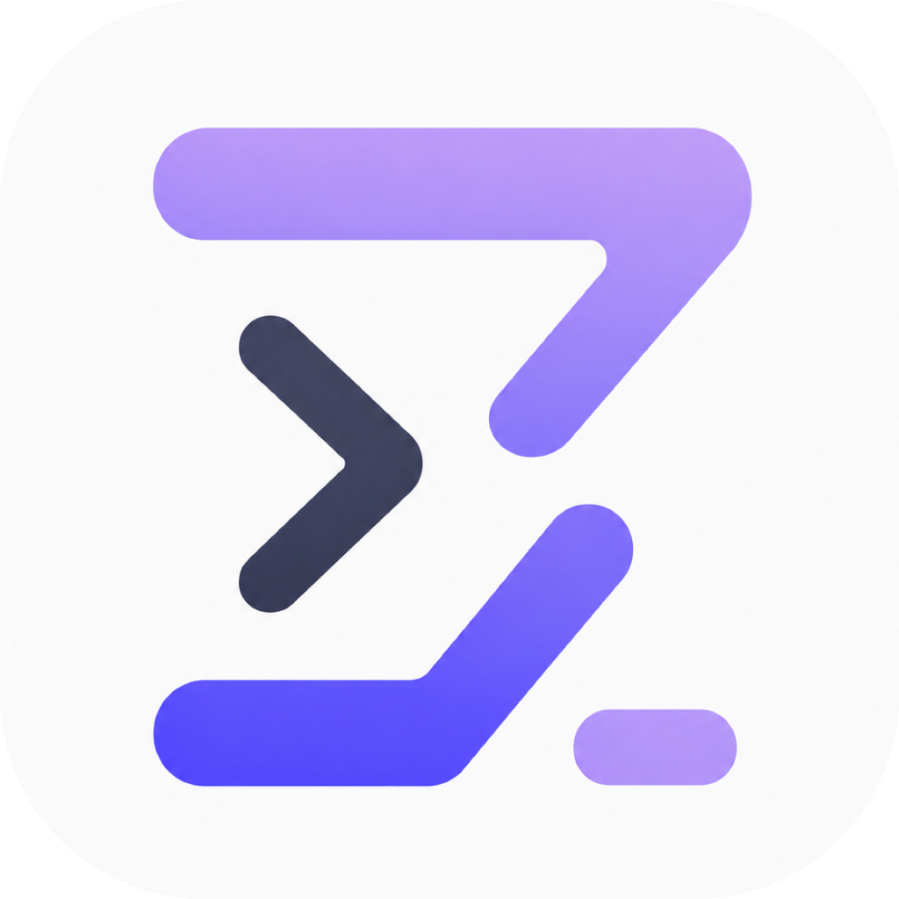

<p align="center">
  <picture>
    <source media="(prefers-color-scheme: dark)" srcset="../../assets/logo.png">
    
  </picture>
</p>

<p align="center">
  
  
  
</p>

<h1 align="center">Zode</h1>

<p align="center">
  <strong>面向终端的开源 AI 原生编码助手。</strong><br/>
  能读取代码、运行命令、搜索文件、管理 git，并通过快速的 Rust TUI 完成这些工作。
</p>

<p align="center">
  <a href="../../README.md">English</a> |
  <a href="README.zh.md">简体中文</a> |
  <a href="README.zh-tw.md">繁體中文</a> |
  <a href="README.ja.md">日本語</a> |
  <a href="README.ko.md">한국어</a> |
  <a href="README.es.md">Español</a> |
  <a href="README.fr.md">Français</a> |
  <a href="README.de.md">Deutsch</a> |
  <a href="README.pt.md">Português</a> |
  <a href="README.ru.md">Русский</a> |
  <a href="README.hi.md">हिन्दी</a> |
  <a href="README.id.md">Bahasa Indonesia</a> |
  <a href="README.th.md">ไทย</a> |
  <a href="README.tr.md">Türkçe</a> |
  <a href="README.vi.md">Tiếng Việt</a>
</p>

---

> 这是本地化 README，覆盖产品概览和快速上手。完整基准测试细节和最新长文说明以 [英文 README](../../README.md) 为准。

## 亮点

- **多提供商**：支持 Anthropic、OpenAI、OpenAI 兼容 API（DeepSeek、Moonshot、OpenRouter 等）以及本地 Ollama。
- **丰富工具面**：文件读写与编辑、代码和内容搜索、前台/后台 shell、git、网页抓取、notebook、TODO 跟踪。
- **浏览器控制**：内置 `browser_*` 工具可驱动托管 Chromium，或通过 Chrome bridge 扩展控制你正在使用的 Chrome。
- **非阻塞权限**：会修改状态的工具都经过 allow once / always / deny 审批，审批提示内联显示，不阻塞你继续输入。
- **默认开启 OS 沙箱**：shell 命令在 macOS `sandbox-exec` 或 Linux `bwrap` 中运行，默认禁止出站网络。
- **全屏 TUI**：流式 Markdown、语法高亮、diff 预览、斜杠命令补全、历史输入、11 套内置主题、设置与帮助浮层，以及 15 种 UI 语言（`/language`）。
- **V1 兼容的持久会话**：保留原有 `<id>.jsonl` 会话协议，同时以旁路数据增加 journal、checkpoint、rewind、fork 和隔离 Git worktree。
- **自动化接口**：稳定的 JSON/JSONL headless 输出、精确会话定位、工具过滤、确定性退出码、stdio ACP 和本地 dashboard。
- **多会话标签页**：用 `Ctrl+T` 并排运行多个隔离会话，并可恢复历史会话。
- **子代理、团队与工作流**：通过 Task 委派一次性任务；子代理也能继续委派（最多三层），还可手动注册内部或外部 CLI 队友，并用 `/agents`、`/team`、`/workflows` 管理。
- **技能、MCP 与 hooks**：按需加载 `SKILL.md`，连接 MCP 服务器，并在工具事件上运行外部脚本。

## 安装

### 一行安装

**macOS / Linux：**

```bash
curl -fsSL https://raw.githubusercontent.com/ZSeven-W/zode/main/scripts/install.sh | sh
```

**Windows (PowerShell)：**

```powershell
irm https://raw.githubusercontent.com/ZSeven-W/zode/main/scripts/install.ps1 | iex
```

安装器会自动识别 OS 和 CPU，从最新 [release](https://github.com/ZSeven-W/zode/releases) 下载匹配的二进制，并把 `zode` 放到 `PATH`。

### 手动下载

在 [releases 页面](https://github.com/ZSeven-W/zode/releases) 下载对应平台的归档：

| OS | 架构 | 资源 |
|----|------|-------|
| macOS | Apple Silicon | `zode-<version>-arm64-mac.tar.gz` |
| macOS | Intel | `zode-<version>-x64-mac.tar.gz` |
| Linux | x86_64 | `zode-<version>-x64-linux.tar.gz` |
| Linux | ARM64 | `zode-<version>-arm64-linux.tar.gz` |
| Windows | x64 | `zode-<version>-x64-windows.zip` |
| Windows | ARM64 | `zode-<version>-arm64-windows.zip` |

解压后把 `zode` 移到 `PATH` 中，例如 `sudo mv zode /usr/local/bin/`。Linux 构建基于 glibc；macOS 二进制未签名，如果 Gatekeeper 提示可运行 `xattr -dr com.apple.quarantine ./zode`。

### 从源码构建

需要 Rust 1.88 或更新版本：

```bash
git clone --recurse-submodules https://github.com/ZSeven-W/zode.git
cd zode
cargo build --release -p zode
```

二进制位于 `target/release/zode`。agent runtime 是 `vendor/agent` git submodule，因此请使用 `--recurse-submodules` 克隆，或运行 `git submodule update --init`。

## 快速开始

最简单的方式是启动 `zode` 并运行 **`/connect`**。它会打开一个交互式模型选择器，并为你写入配置。

也可以手动写 `~/.zode/config.json`：

```jsonc
{
  "providers": {
    "anthropic": {
      "type": "anthropic",
      "apiKey": "sk-...",
      "models": { "claude-sonnet-4-6": {} }
    }
  },
  "provider": { "model": "claude-sonnet-4-6" }
}
```

常用启动方式：

```bash
zode                          # 全屏 TUI
zode -p "explain main.rs"     # headless：执行一次提示并输出到 stdout
zode --no-tui                 # 普通 readline REPL
zode -c                       # 继续最近的会话
zode -r <id>                  # 按 id 前缀恢复会话
zode --yolo                   # 跳过审批提示（硬拒绝规则仍生效）
zode --no-sandbox             # 关闭 OS 沙箱
zode --sandbox-read-only      # 只读沙箱
zode --sandbox-allow-network  # 允许沙箱内出站网络
zode --browser                # 强制启用浏览器工具
zode --model <id>             # 覆盖模型
zode --provider <name>        # 选择配置中的提供商
zode server                   # 通过 stdio 运行 JSON-RPC app-server
zode acp                      # 通过 stdio 运行 ACP agent
zode dashboard                # 查看本地会话、checkpoint 和 worktree
```

## Task 模式

Task 的执行模式与 `agent_type` 正交：任意内置或自定义 agent 类型都可组合
已注册的 `plan` 和 `read-only` 子模式。省略 `mode` 时使用 `inherit`；
`default` 是相同行为的别名。

```json
{
  "agent_type": "my-custom-agent",
  "description": "设计迁移方案",
  "prompt": "检查当前 schema，并返回实施计划。",
  "mode": "plan"
}
```

`inherit` 保留调用方的能力上限。`read-only` 在该上限内仅保留只读工具，但仍
正常完成任务；`plan` 使用相同的只读边界，并要求子代理返回实施计划。两者都不能
获得调用方原本没有的权限、写入能力或网络访问，也不会切换调用方自身的模式。
`bypass`/`yolo`、关闭沙盒等提升能力的状态不会成为子模式。外部 CLI Task
worker 目前仅支持 `inherit`（包括省略 `mode` 或使用 `default`）；非 inherit
模式会被拒绝。

内部 Task 子代理还会继承调用方最终注册工具集中的所有已启用 Skill 和 MCP 工具。
子代理提示包含相同的 Skill 索引，重建后的 ToolSearch 也能发现继承的 `Skill`
与 `mcp__<server>__<tool>`。父级 plugin/tool filter 始终有效；`plan` 和
`read-only` 会保留 Skill，但会剔除副作用未知的 MCP 工具。外部 CLI worker
不会继承 Zode 进程内工具。

## 手动注册外部 CLI 队友

Zode 可以把第三方 agent CLI 用作一次性 Task worker，或加入可持续对话的
team。注册是显式的：即使可执行文件已经位于 `PATH`，Zode 也不会自动暴露给
模型；必须在 `externalAgents.agents` 中添加 profile。
也可以运行 `/external-agents` 查看 `PATH` 中受支持的 CLI，再运行
`/external-agents discover` 将发现的预置显式注册到全局配置。Zode 启动时仍不会自动扫描或注册。

| Profile | 命令 | Task | Team 模式 | 外部 CLI 沙箱 |
|---|---|---:|---:|---|
| `claude-code` | `claude` | 是 | persistent | unrestricted |
| `codex` | `codex` | 是 | persistent | workspace-write |
| `opencode` | `opencode` | 是 | stateless | unknown |
| `cline` | `cline` | 是 | stateless | unrestricted |
| `antigravity` | `agy` | 是 | stateless | unknown |
| `cursor` | `cursor-agent` | 是 | persistent | unrestricted |
| `kiro` | `kiro-cli` | 是 | stateless | unrestricted |
| `pi` | `pi` | 是 | persistent | unrestricted |
| `grok` (Grok Build) | `grok` | 是 | persistent | unrestricted |

### 添加 profile

在全局 `~/.zode/config.json` 或项目级 `.zode/config.json` 中配置。已知
profile 使用空对象即可手动启用；`command` 可写 `PATH` 中的裸命令名或路径：

```jsonc
{
  "externalAgents": {
    "agents": {
      "claude-code": {},
      "codex": {},
      "opencode": {},
      "cline": {},
      "antigravity": {},
      "cursor": {},
      "kiro": {},
      "pi": {},
      "grok": {},
      "my-agent": {
        "command": "my-agent",
        "args": ["run", "--json", "{prompt}"],
        "promptTransport": "argv",
        "output": "jsonl",
        "textSource": "/event/delta",
        "sessionIdSource": "/session/id",
        "resumeArgs": ["--session", "{session_id}"],
        "effectiveSandbox": "workspaceWrite",
        "authEnv": ["MY_AGENT_API_KEY"],
        "trusted": false
      }
    }
  }
}
```

只添加确实要暴露的 profile。已知预设可覆盖 `enabled`、`command`、
`extraArgs`、`envAllow` 和 `trusted`。自定义 profile 的
`promptTransport` 支持 `stdin`、`argv`、`file`；`output` 支持 `text`、
通用 `jsonl`、`jsonl-claude`、`jsonl-codex`。通用 JSONL 通过 RFC 6901
`textSource` 和 `sessionIdSource` 提取文本与会话 ID；`resumeArgs` 必须包含
独立的 `{session_id}`。没有可恢复会话的 CLI 会作为无状态 teammate，每次派发
启动新进程，也可作为一次性 Task worker。
`newSessionArgs` 也可包含独立的 `{session_id}`：Zode 会为首次运行生成
ID，后续派发使用 `resumeArgs`。

外部进程只继承 `PATH`、`HOME`、`TERM` 等基础环境；API key 等变量需加入
`envAllow` 或 `authEnv`。普通模式首次雇佣会显示命令、工作目录和沙箱并请求
信任；Zode 只审批进程启动，不会逐项审批外部 CLI 的文件修改和 shell 命令。
`--yolo` 等无交互模式必须显式设 `trusted: true` 才会运行。

### 使用 team

`TeamHire` 和 `TeamSend` 是模型工具，不是斜杠命令。直接告诉 leader：

```text
雇佣 `codex`，命名为 `implementer`，负责实现认证重构并运行测试。
把任务发给 `implementer`，编辑前先 claim `src/auth/`。
```

之后用 `/team`、`/team board` 查看名册和协作板，用
`/team dismiss implementer` 移除队友。team 状态保存在
`<cwd>/.zode/team/`，但外部 CLI 的信任授权不会跨 Zode 进程持久化。

**命名规则**：队友名字（雇佣时的 `name`）只允许小写 ASCII——`a-z`、`0-9`、
`-`，最长 32 字符；名字会出现在 `@ask 名字:` 转发行和会话文件名里，因此
**不支持中文等非 ASCII 名字**，会直接报 NameInvalid。外部 profile 名
（`externalAgents.agents` 的 key，即雇佣时 `agent` 引用的名字）同样请使用
ASCII：`/external-agents discover` 注册的是固定英文预置名，中文等非 ASCII
的自定义 key 未经测试、不受支持。

## 新功能使用指南

### 结构化 headless

`-p`、`--prompt-file` 和 `--prompt-json` 共用同一套 headless 引擎。`json`
只输出最终结果对象；`stream-json` 按行输出版本化的
`zode.run-event.v1` 事件。结构化模式会把 stdout 专用于机器可读数据，并用
稳定退出码：`0` 成功、`10` provider 错误、`11` 权限拒绝、`12` 轮次上限、`13` 中断（Ctrl-C）、`14` 部分结果、`15` 会话定位错误。

```bash
zode -p "修复失败测试" --output-format json --max-turns 12
zode -p "审查仓库" --output-format stream-json \
  --tools 'File*,ContentSearch,Git' --disallowed-tools FileWrite
zode --prompt-file prompt.txt --permission-mode accept-edits
zode --prompt-json '{"prompt":"总结当前工作区"}'

# 精确 ID 不做前缀匹配；fork 不会修改源会话。
zode -p "继续工作" --session-id my-session
zode -p "尝试另一种方案" --fork-session my-session --fork-worktree
```

工具 deny 规则优先于 allow，并会传递给 Task 子代理。`--permission-mode`
支持 `default`、`dont-ask`、`accept-edits`、`bypass`；`--yolo` 仍是 bypass
的快捷方式，但硬拒绝规则始终生效。

### 直接扩展 Session V1

会话 transcript 仍然只有一份：`~/.zode/sessions/<id>.jsonl`。旧版 Zode
可以继续读写它；新版也直接读写同一个文件。新增数据只放在
`~/.zode/sessions/<id>/` 旁路目录中，包括 `meta.json`、journal、checkpoint
和 snapshot，因此无需新增会话版本，也没有 transcript 双写问题。

```bash
zode session list
zode session list --json
zode session show <id>                         # 查看 metadata 和 checkpoint ID
zode session fork <id> --target-id experiment
zode session fork <id> --checkpoint <cp> --worktree
zode session rewind <id> <cp>                  # 只预览冲突与改动
zode session rewind <id> <cp> --apply
zode session apply-back <id> --target /path/to/checkout
zode session delete <id> --remove-worktree
```

系统会在有修改副作用的 turn 前创建 checkpoint。Rewind 会恢复已跟踪文件和
会话消息前缀，遇到新改动时报告冲突而不是覆盖；历史 journal 不会被删除，
而是建立新的逻辑分支。worktree fork 的结果需要通过 `apply-back` 显式合回。

### 权限规则和沙箱 profile

权限规则可以写进 `config.json` 的 `permissions.rules`，也可以用
`--rules ./permissions.json` 临时加载。字段匹配使用 RFC 6901 JSON pointer；
优先级固定为 deny > ask > allow。
独立 rules 文件只能是规则数组或 `{ "rules": [...] }`，不要再套一层
`permissions`。

```jsonc
{
  "permissions": {
    "deny": ["Remove"],
    "rules": [
      {
        "behavior": "allow",
        "tool": "Bash",
        "matcher": {
          "kind": "field",
          "pointer": "/command",
          "pattern": { "kind": "glob", "value": "git status*" }
        }
      },
      {
        "behavior": "deny",
        "tool": "Bash",
        "matcher": {
          "kind": "field",
          "pointer": "/command",
          "pattern": { "kind": "glob", "value": "*--force*" }
        }
      }
    ]
  },
  "sandbox": {
    "profiles": {
      "ci": {
        "enabled": true,
        "mode": "workspace-write",
        "network": false,
        "writableRoots": ["/tmp/build-cache"]
      }
    }
  }
}
```

```bash
zode -p "只做检查" --sandbox-profile read-only
zode -p "运行检查" --sandbox-profile workspace
zode -p "下载依赖" --sandbox-profile workspace-network
zode -p "运行 CI" --sandbox-profile ci --rules ./permissions.json
```

内置 profile 为 `read-only`、`workspace`、`workspace-network` 和
`unconfined`；也可以像上例一样定义自己的 profile。

### 插件和静态 marketplace

受管理插件可包含 skills、commands、agents、hooks、MCP、LSP 和受限的 JavaScript
UI 渲染器。Zode 支持
`plugin.json`、`.zode-plugin/plugin.json`、`.codex-plugin/plugin.json`、
`.grok-plugin/plugin.json` 和 `.claude-plugin/plugin.json`。同时支持 Codex
与 Claude Code 的组件路径数组，并在首次安装时遵循 Claude Code 的
`defaultEnabled`。Codex apps/connectors 以及 Claude Code themes、monitors、
output styles 等宿主专属组件会被忽略；仅包含 app 的插件会因没有 Zode 可用组件而
拒绝安装。安装内容会复制为带来源与 SHA-256 tree hash 的不可变快照；包含可执行
能力的插件只有在显式传入 `--trust` 后才会启用。

#### JavaScript UI 插件快速开始

最小 UI 插件只需要 manifest 和一个 JavaScript 文件：

```text
my-plugin/
├── plugin.json
└── scripts/
    └── ui.js
```

`plugin.json`：

```json
{
  "name": "my-plugin",
  "version": "0.1.0",
  "ui": {
    "sidebar": "./scripts/ui.js",
    "statusLine": "./scripts/ui.js"
  },
  "permissions": {
    "network": ["quota.example.com"],
    "env": ["CODING_PLAN_TOKEN"],
    "context": ["tabs", "workspace", "tools", "tasks", "services"]
  }
}
```

可以安装本地目录，也可以直接安装 GitHub 仓库或仓库子目录。正在运行的 Zode
需要重启，才会载入新的插件快照：

```bash
zode plugin validate ./my-plugin
zode plugin install ./my-plugin --trust
zode plugin install owner/repo@main#plugins/my-plugin --trust
zode plugin list
```

修改源代码后运行 `zode plugin update my-plugin` 更新已安装快照。由于
JavaScript、hooks、MCP server 和声明的网络访问都属于可执行能力，安装时必须显式
传入 `--trust`。安装和更新都会打印插件声明的权限（网络域名、环境变量、context
scope）。如果更新后的 manifest 申请的权限**超出**已安装快照，更新会被拒绝，
必须重新携带 `--trust` 才能接受——活动的 Git 源无法静默扩大自己的授权。

#### UI 渲染 API

UI 插件可以在 sidebar 版本号正上方渲染声明式内容——所有插件按加载顺序合计
最多 6 行。manifest 指定 JS 入口：

```json
{
  "name": "my-sidebar",
  "ui": {
    "sidebar": "./ui/sidebar.js",
    "statusLine": "./ui/status-line.js"
  }
}
```

JS 通过 `zode.ui.sidebar` 注册同步渲染函数。`ctx` 是只读 JSON 快照，包含终端、
会话、模型、状态、token 和上下文窗口信息；脚本不会获得文件系统、网络、终端或
Ratatui 句柄，最终样式与宽度由 Zode 控制。

```js
zode.ui.sidebar((ctx) => ({
  lines: [
    {
      spans: [
        { text: ctx.model.id, tone: "accent", bold: true },
        { text: `  ctx ${ctx.context.usedPercent ?? "?"}%`, tone: "muted" }
      ]
    }
  ]
}));
```

`tone` 支持 `default`、`muted`、`accent`、`success`、`warning`、`danger`，
span 还支持 `bold` 和 `italic`。renderer 必须是同步函数。每个脚本最大
256 KiB，每次执行最多使用 8 MiB JS 内存和 25 ms，且 renderer 最快每 250 ms
重新求值一次（间隔内复用缓存输出）；sidebar 每个 renderer 最多 6 行（所有插件
合计也是 6 行），每行最多 16 个 span、2,048 字节文本，控制字符会由宿主清理。

状态栏也可以扩展：没有插件输出时保持 1 行；同步的
`zode.ui.statusLine` renderer 返回 spans 后，布局会动态扩展为 2 行。Zode
自身的核心状态和安全提示固定在第一行，插件输出合并到第二行。

```js
zode.ui.statusLine((ctx) => ({
  spans: [
    { text: ctx.session.title, tone: "accent", bold: true },
    { text: `  ↑${ctx.tokens.input} ↓${ctx.tokens.output}`, tone: "muted" }
  ]
}));
```

#### 渲染上下文与权限

每个 renderer 都能直接获得以下基础字段，无需额外申请 context 权限：

| 字段 | 结构与含义 |
| --- | --- |
| `ctx.apiVersion` | 上下文 API 版本，目前为 `1`。 |
| `ctx.app` | `{ version, effort }`。 |
| `ctx.terminal` | `{ width, height }`，单位为终端 cell。 |
| `ctx.session` | 当前任务的 `{ id, title, cwd, busy }`。 |
| `ctx.model` | `{ id, provider }`。 |
| `ctx.status` | `{ mode, planMode, selectionMode, yolo, sandbox }`；`sandbox` 为 `{ enabled, readOnly, network }`。 |
| `ctx.tokens` | `{ input, output }` token 计数。 |
| `ctx.context` | `{ used, window, usedPercent }`；无法计算时百分比为 `null`。 |
| `ctx.data` | 仅包含当前插件自己注册的后台数据源结果。 |

更丰富的信息只有在 `permissions.context` 声明对应 scope 后才会出现：

| Scope | 暴露字段 | 结构与限制 |
| --- | --- | --- |
| `tabs` | `ctx.tabs` | `{ active, count }`；`active` 从 1 开始。 |
| `workspace` | `ctx.workspace.modifiedFiles` | 最多 50 条 Git `{ path, added, removed }`。 |
| `tools` | `ctx.tools.available` | 当前任务启用的工具名，已排序。 |
| `tools` | `ctx.tools.active` | 当前正在执行的工具名。 |
| `tools` | `ctx.tools.recent` | 最近最多 20 条 `{ name, status, durationMs }`。 |
| `tasks` | `ctx.tasks.todoStatuses` | 只有 Todo 状态，不包含 Todo 正文。 |
| `tasks` | `ctx.tasks.subagents` | `{ type, status }`，不包含 prompt 或对话。 |
| `tasks` | `ctx.tasks.goal` | `{ active, turn }`，不包含 Goal 正文。 |
| `services` | `ctx.services.mcp` | `{ name, connected }`。 |
| `services` | `ctx.services.lsp` | `{ language, running }`。 |

例如：

```json
{
  "permissions": {
    "context": ["tabs", "workspace", "tools", "tasks", "services"]
  }
}
```

`ctx.tools` 是观察接口：插件可以知道有哪些工具、哪些工具正在运行或最近运行过，
但 UI 插件不能直接调用工具。工具输入/输出、prompt、对话正文、Todo/Goal 正文、
环境变量值和凭证都不会暴露，也不能借此绕过 Zode 原有的审批系统。

#### 后台 HTTP 数据

UI 插件还可以注册后台 HTTP 数据源。网络域名和凭证环境变量必须在 manifest 中
显式声明：

```json
{
  "permissions": {
    "network": ["quota.example.com"],
    "env": ["CODING_PLAN_TOKEN"]
  }
}
```

请求采用声明式配置，在渲染路径之外执行。Zode 只在 Rust 请求层把环境变量组装进
header，JS 无法读取 token：

```js
zode.data.define("codingPlan", {
  refreshIntervalMs: 60000,
  request: {
    url: "https://quota.example.com/v1/usage",
    method: "GET",
    timeoutMs: 3000,
    headers: {
      Authorization: { env: "CODING_PLAN_TOKEN", prefix: "Bearer " }
    }
  }
});

zode.ui.statusLine((ctx) => ({
  spans: [
    {
      text: `remaining ${ctx.data.codingPlan?.data?.remaining ?? "…"}`,
      tone: "accent"
    }
  ]
}));
```

`zode.data.define(key, config)` 的 key 长度为 1–64，只能包含字母、数字、下划线
和连字符。`request` 支持 `url`、`method`、`headers`、可选 JSON `body` 和
`timeoutMs`。默认使用 `GET`、3 秒超时和 60 秒刷新间隔，目前只允许 HTTPS
`GET`/`POST`。普通 header 值是字符串；秘密 header 使用
`{ "env": "NAME", "prefix": "Bearer " }`。环境变量还必须列在
`permissions.env` 中，只会由 Rust 请求层在发送时读取，永远不会返回给 JS。

`request.headers` 也可以是一个**函数**，用于动态鉴权（如 HMAC-SHA256 签名）。
Zode 会在每次请求前调用该函数，传入上下文对象（`method`、`url`、`body`、
`timestamp`、`secrets`），并使用返回的 header 键值对。`zode.crypto` 全局对象
（`sha256hex`、`hmacSha256Hex`、`hmacSha256HexKey`）提供加密原语，使任意签名
算法均可用纯 JS 实现——包括火山引擎 HMAC-SHA256 和 AWS SigV4 派生密钥链。

Zode 会禁用重定向和代理、校验并固定公网 DNS、拒绝 localhost/私网、把响应限制为
256 KiB、把请求超时限制在 500 ms 到 10 秒，并将刷新间隔限制在 10 秒到 1 小时。
`*.example.com` 只匹配子域名，不匹配裸域名 `example.com`。

每个插件只能看到自己的数据。`ctx.data.<key>` 的结果是
`{ ok, status, data, updatedAt }`，请求失败时为
`{ ok: false, error, updatedAt }`。JSON 响应会成为对象或数组，非 JSON 响应会
成为字符串；HTTP 错误状态仍会提供 `status` 和 `data`，同时 `ok` 为 `false`。

调用私有配额或 Coding Plan API 时，需要在启动 Zode 前提供环境变量：

```bash
CODING_PLAN_TOKEN=... zode
```

[完整的可运行示例](../../examples/plugins/zode-ui-demo/)会在 sidebar 和状态栏显示
模型、上下文和工具活动，并通过 `zode.data.define` 读取公开的 GitHub API 配额。

```bash
zode plugin list --json
zode plugin details my-plugin
zode plugin disable my-plugin
zode plugin enable my-plugin
zode plugin update my-plugin
zode plugin uninstall my-plugin

# marketplace 是本地目录或 Git 静态索引，不依赖 Zode 云服务。
zode plugin marketplace add owner/plugin-index --trust
zode plugin marketplace list --json
zode plugin install my-plugin@MARKETPLACE_NAME --trust  # 同名时指定来源
zode plugin marketplace update
```

### ACP、dashboard、OTLP 与 PTY 测试

`zode acp` 通过 stdio 实现 ACP initialize/new/load/fork/prompt/cancel，向客户端
流式发送消息、思考和工具事件，通过客户端请求权限，并支持客户端提供的 stdio、
HTTP、SSE MCP server。它与 TUI/headless 共用同一套 V1 兼容会话存储。

```bash
zode acp
zode dashboard
zode dashboard --json
```

OTLP 默认关闭，必须显式设置 `ZODE_OTEL=1`。导出的只有不含内容的生命周期、
工具名、状态和 token usage 属性；不会导出 prompt、模型文本、工具输入/输出、
文件路径或错误消息。

```bash
ZODE_OTEL=1 \
OTEL_EXPORTER_OTLP_ENDPOINT=http://127.0.0.1:4318 \
zode -p "运行测试" --output-format json
```

仓库还提供真实 PTY + VT100 虚拟屏幕测试工具，可记录 raw diagnostics 和屏幕快照：

```bash
cargo test -p zode-pty-harness
cargo run -p zode-pty-harness --bin zode-pty-scenario -- scenario.json
```

`scenario.json` 会按顺序驱动真实终端的等待、按键、resize 和 snapshot；按键写法
支持 `<Enter>`、`<Esc>`、`<Tab>`、方向键、`<Backspace>`、`<C-c>`、`<C-d>`
和 `<C-l>`：

```json
{
  "command": ["target/debug/zode", "--no-sandbox"],
  "rows": 40,
  "cols": 120,
  "steps": [
    { "action": "wait_for_text", "text": "zode", "timeout_ms": 5000 },
    { "action": "send_keys", "keys": "hello<Enter>" },
    { "action": "resize", "rows": 50, "cols": 140 },
    { "action": "snapshot", "path": "target/pty/after-input.json" }
  ]
}
```

本地开源版本明确不包含 xAI 专用账号/计费，也不建设由 Zode 运营的云 marketplace
服务。

## 配置要点

`providers` 是模型提供商的来源；顶层 `provider` 指向当前活动模型。OpenAI 兼容提供商通常需要 `baseUrl` 和 `dialect`：

```jsonc
{
  "providers": {
    "deepseek": {
      "type": "openai",
      "apiKey": "sk-...",
      "baseUrl": "https://api.deepseek.com/v1",
      "dialect": "deepseek",
      "models": {
        "deepseek-v4-pro": { "contextWindow": 1000000, "maxOutputTokens": 16384 },
        "deepseek-chat": {}
      }
    }
  },
  "provider": { "model": "deepseek-v4-pro" },
  "language": "zh-CN"
}
```

一个 provider 可以包含多个模型，并可通过 `/model` 实时切换。`language` 也可通过 `/language` 修改。

## Server 模式与 SDK

`zode server` 会在 stdin/stdout 上启动换行分隔的 JSON-RPC server，适用于编辑器集成、本地自动化、测试和 SDK 客户端。

```bash
zode server
zode server --listen stdio://
zode server --listen off
```

这里的“不支持”只限定 app-server 协议本身：它暂不提供托管 marketplace 管理、
远程控制、Realtime、后台终端、thread archive/fork、goals 和 app connector。
上文的本地 Session V1 命令与静态插件 marketplace 是独立 CLI 能力，不受此限制。

SDK 位于 [`sdk/`](../../sdk/)：

| SDK | 目录 | 本地测试 |
|-----|------|----------|
| Rust | [`sdk/rust`](../../sdk/rust/) | `cargo test -p zode-sdk-rust` |
| TypeScript | [`sdk/typescript`](../../sdk/typescript/) | `pnpm --dir sdk/typescript test` |
| Python | [`sdk/python`](../../sdk/python/) | `PYTHONPATH=sdk/python/src python3 -m unittest discover -s sdk/python/tests` |
| Go | [`sdk/go`](../../sdk/go/) | `(cd sdk/go && go test ./...)` |
| Kotlin/JVM | [`sdk/kotlin`](../../sdk/kotlin/) | `(cd sdk/kotlin && gradle test)` |

方法、参数、返回值和 SDK enum/constant 名称记录在 [`sdk/` 方法参考](../../sdk/README.md#method-reference) 中。

## 浏览器控制

Zode 提供 `tools:browser` 工具组：

- `BrowserRead`：截图、DOM 快照、console/network 日志、标签页读取。
- `BrowserAct`：导航、点击、输入、按键、滚动。
- `BrowserEval`：执行 JavaScript。
- `BrowserTabs`：管理标签页。

可选目标：

- **managed**：Zode 启动并控制专用 Chromium profile。
- **bridge**：通过 [`extensions/chrome/`](../../extensions/chrome/) 中的 MV3 扩展控制你正在使用的 Chrome profile。

首次升级后运行一次新版 Zode 并执行 `/browser pair`。这会注册仅允许固定扩展 ID
调用的 Chrome Native Messaging host。之后即使没有打开 Zode CLI，侧栏也会自动
启动一个无终端的本地 Zode daemon，并使用已保存的 token 恢复任务和历史记录。
从侧栏提交任务时，浏览器工具会绑定侧栏旁边的当前页面，因此“分析当前页面”会
直接读取现有标签页，不再新建标签页；独立的 TUI/CLI 自动化仍使用 `zode` 标签组。
侧栏中的“这个”“当前内容”等含糊表达也默认指向当前页面，Agent 会先读取页面；
只有用户明确询问项目、代码或本地文件时，才会优先检查本地工作区。

常用命令：

```bash
/browser
/browser status
/browser launch
/browser close
/browser pair
/browser target managed
/browser target bridge        # 切换到扩展桥接，并保存为下次启动的默认目标
/browser screenshot [path]
```

扩展加载、更新、CRX 打包和 smoke test 步骤见 [`extensions/chrome/README.md`](../../extensions/chrome/README.md)。

## 桌面控制

Zode 还能通过操作系统的无障碍(accessibility)API 驱动原生桌面应用,不局限于浏览器:

- `DesktopRead`:读取无障碍树(窗口、元素及其 ref)。
- `DesktopAct`:按元素点击、输入、滚动、设值。
- `DesktopScreenshot`:截屏。

只读读取无需审批;有副作用的桌面操作走与其他工具相同的 允许一次/始终/拒绝 审批流。

各平台后端:

- **macOS** — Accessibility(AX)API。
- **Windows** — UI Automation(UIA)。
- **Linux** — AT-SPI。
- **Electron 应用** — 通过 Chrome DevTools Protocol 附加。

**假光标与 Esc 急停。** Zode 从不移动你的真实鼠标。macOS 上一个零权限的覆盖层
(`zode-overlay`)会画一个*假*光标,沿平滑的 Dubins 路径飞向每个操作目标,方便你
跟踪 Agent 的动作(输入的文本不会显示在覆盖层里)。桌面自动化进行时,全局 **Esc**
会中断所有正在运行的回合并隐藏覆盖层(与 TUI 的 Esc 同一条急停路径)。其他平台
照常执行桌面操作,只是没有可视化。

没有 US 布局键码的字符(CJK、部分标点)通过系统剪贴板投递(写入 → 合成粘贴 →
还原原剪贴板),使自定义按键处理的应用也能收到真实字符。

```bash
/desktop          # 显示桌面目标与权限状态
/desktop status   # 同上
```

配置位于 `~/.zode/config.json` 的 `desktop.*`:

```json
{
  "desktop": {
    "ghostCursor": true,
    "escCancel": true,
    "overlayHelperPath": null
  }
}
```

`ghostCursor`(默认 `true`)绘制 macOS 覆盖层光标;`escCancel`(默认 `true`)在自动化
期间启用全局 Esc 中断;`overlayHelperPath`(默认 `null`)覆盖 `zode-overlay` 助手
路径——助手缺失时仅关闭可视化。桌面自动化首次使用可能会请求系统权限(如 macOS
辅助功能)。

## 常用斜杠命令

| 命令 | 作用 |
|---|---|
| `/help` | 命令和快捷键帮助 |
| `/connect` | 连接并切换当前 provider |
| `/model [id]` | 查看或设置当前模型 |
| `/theme [id]` | 切换主题（`catppuccin-mocha`、`aurora-forge`、`ember-atelier`、`sakura-paper`、`arctic-day`、`lavender-mist`、`citrus-grove`、`verdant-signal`、`cyberpunk`、`minimal`、`hacker`） |
| `/config` | 查看模型与工作目录 |
| `/sessions`, `/resume` | 恢复历史会话 |
| `/browser ...` | 浏览器控制面板和命令 |
| `/tasks` | 后台 shell 和运行中的 turn |
| `/mcp` | 管理 MCP server |
| `/skills` | 列出可用技能 |
| `/agents` | 管理子代理 |
| `/external-agents [list\|discover]` | 查看 `PATH` 中受支持的外部 CLI，或显式注册所有发现的预置 |
| `/team [status\|board\|dismiss <name>]` | 查看持久队友名册和共享 board，或移除队友 |
| `/workflows` | 管理和运行 JS 工作流 |
| `/sandbox ...` | 查看或控制 OS 沙箱 |
| `/language` | 切换 UI 语言 |
| `/export [path]` | 导出会话为 Markdown |
| `/exit` | 退出 |

完整命令表见 [英文 README](../../README.md#slash-commands)。

## 项目指令、MCP 与技能

Zode 会按层级读取指令：全局 `~/.zode/`、项目根目录、当前工作目录；每层优先使用 `AGENTS.md`，再回退到 `CLAUDE.md`。技能位于 `.zode/skills/**/SKILL.md`，MCP server 位于 `~/.zode/mcp.json`、`.mcp.json` 或 `.zode/mcp.json`，hooks 位于 `~/.zode/hooks.json` 或 `.zode/hooks.json`。

Zode 会读取 Claude Code、Codex、opencode、Cursor、Gemini 等其他 agent 的直接
skills 目录和 MCP 配置，但不会扫描这些产品安装的 plugin tree 或 plugin cache。
需要复用插件时，请通过 `zode plugin install ... --trust` 显式安装；通过 Zode
安装时仍兼容 Codex 与 Claude Code 的插件包格式。

## ZSeven-W 生态

Zode 属于 ZSeven-W 面向 AI 原生开发工具的一组产品：

| 产品 | 定位 |
|------|------|
| [`agent-rs`](https://github.com/ZSeven-W/agent-rs) | 纯 Rust 异步 LLM agent runtime，提供多提供商流式输出、工具调度、权限、MCP、成本跟踪、附件、会话和可选编码工具。 |
| [`jian`](https://github.com/ZSeven-W/jian) | Rust 原生跨平台 UI 框架，让 `.op` 文件成为应用，把 OpenPencil 风格设计产物连接到可运行软件。 |
| [`noema`](https://github.com/ZSeven-W/noema) | 面向编码 agent 的 local-first、非向量记忆系统，包含词法召回、review queue、MCP、S3 offload 和企业策略控制。 |
| [`openpencil`](https://github.com/ZSeven-W/openpencil) | 开源 AI 原生向量设计工具，面向 design-as-code 工作流，可在实时画布上把 prompt 转成 UI，并支持并发 agent teams。 |

## 基准测试

Zode 的 benchmark 覆盖 one-shot 代码生成、agentic 读/跑/改/修、多文件任务、疑难 bug、MCP/Skills/约束遵循，以及 Noema LOCOMO runner。完整方法、复现命令和结果表见 [英文 README 的 Benchmark 部分](../../README.md#benchmark)，套件位于 [`benchmarks/`](../../benchmarks/)。

## 开发

```bash
cargo build --workspace
cargo run -p zode
cargo run -p zode -- -p "<prompt>"
cargo test --workspace
cargo clippy --workspace --all-targets -- -D warnings
cargo fmt --all
cargo deny check
```

## 贡献

欢迎贡献。请遵循 [Conventional Commits](https://www.conventionalcommits.org/)：`<type>(<scope>): <subject>`，常见 scope 包括 `core`、`tui`、`cli`、`tools`、`config`、`build`、`ci`、`docs`。

## 许可证

[MIT](../../LICENSE) &copy; ZSeven-W
